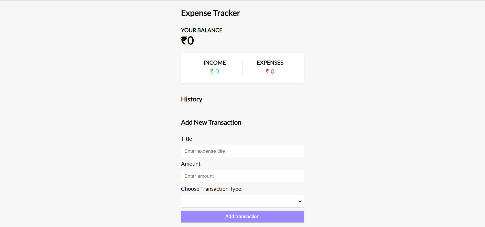

# Expense-Tracker

Expense Tracker is a user-friendly web application designed to help individuals manage their expenses. Built on Vue3, a progressive JavaScript framework, Expense Tracker offers a seamless and responsive user experience.

# Features

Check balance:

- This feature allows users to view their current balance, providing them with an overview of their financial situation at any given time.

Track Total Income and Expenses:

- This feature enables users to monitor their overall financial activity by tracking both income and expenses.

Expense Entry:

- Provide a user-friendly interface for users to input their expenses.

Expense History:

- Maintain a record of past expenses, allowing users to view and analyze their spending history. 

Add New Transaction:

- This feature allows users to manually add new transactions to their expense tracker.

# Screenshots

- Home Page

  

# Built With

- HTML
- CSS
- Vue3
- Vue3 Toastification

# Visit Expense-Tracker

- [Live Demo](https://javidvajid.github.io/Expense-Tracker/)

# Acknowledgements

- [Vue 3 & Composition API - Full Project](https://www.youtube.com/watch?v=hNPwdOZ3qFU&t=1226s&ab_channel=TraversyMedia)

#How to deploy to Github

- [How to Deploy Your Vite App to Github Pages](https://www.youtube.com/watch?v=yo2bMGnIKE8&ab_channel=LearnVue)

# Show your support

- If you like the project then don't forget to give a ⭐.
